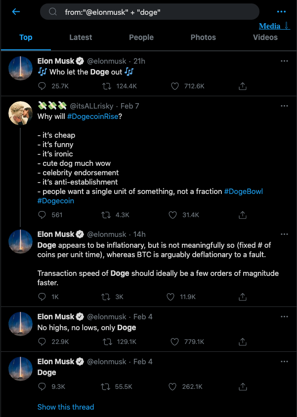
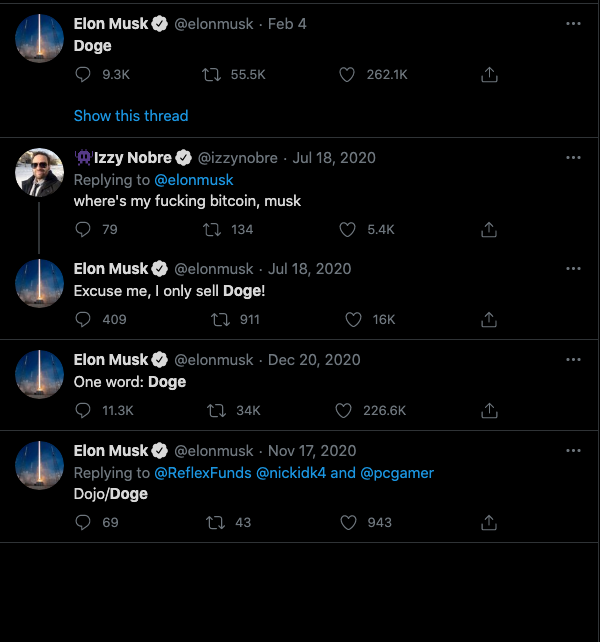
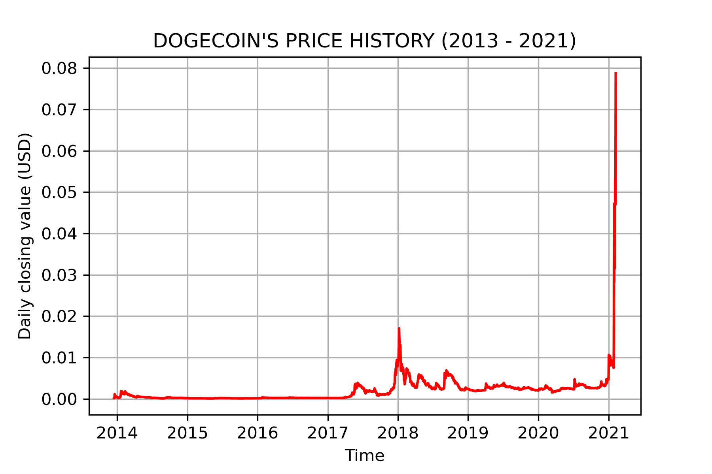
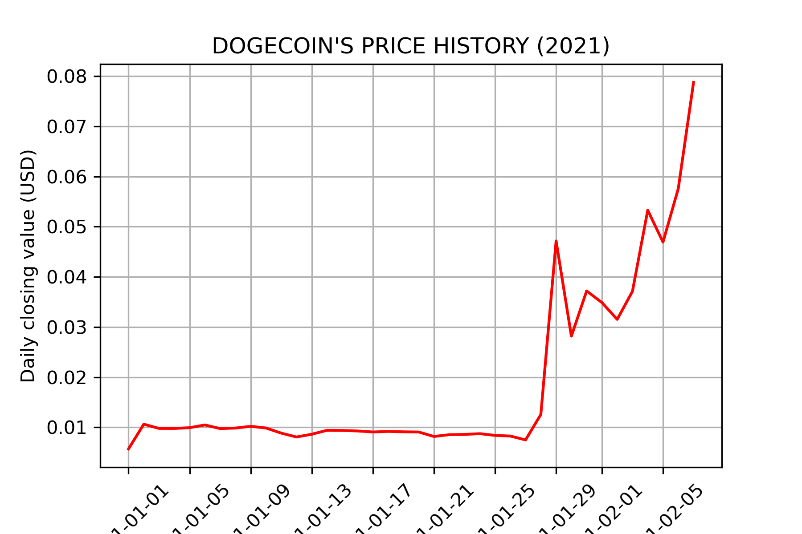
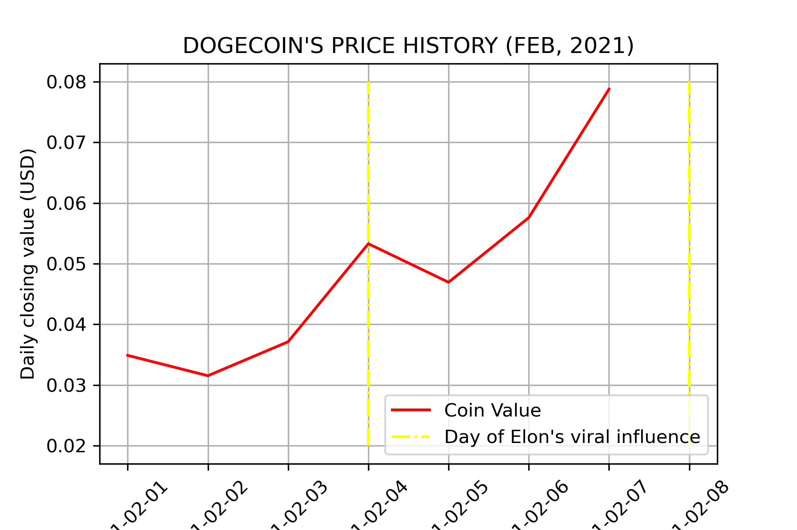

# DOGECOIN Analysis

This project scrapes and compiles the entire history of DOGECOIN

## Motivation

Trends show that memes and Elon influenced the rise of DOGECOIN and I wanted to explore the data for myself

## Setup
There are two scripts in this project
1. The JavaScript code in `index.js` file which downloads the entire history of the cryptocurrency
2. The Jupyter notebook `analysis/DOGE_analysis.ipynb` which was used to plot the history and spots of inluence

Because this project uses isomorphic fetch, you need to install dependencies

```bash
npm install
```

## Usage
```npm start``` downloads the history as a csv file 

## Contributing
Pull requests are welcome. For major changes, please open an issue first to discuss what you would like to change.

## Screenshots

<br/>
<br/>

<br/>
<br/>

<br/>
<br/>

<br/>
<br/>

<br/>
<br/>

<br/>
<br/>
